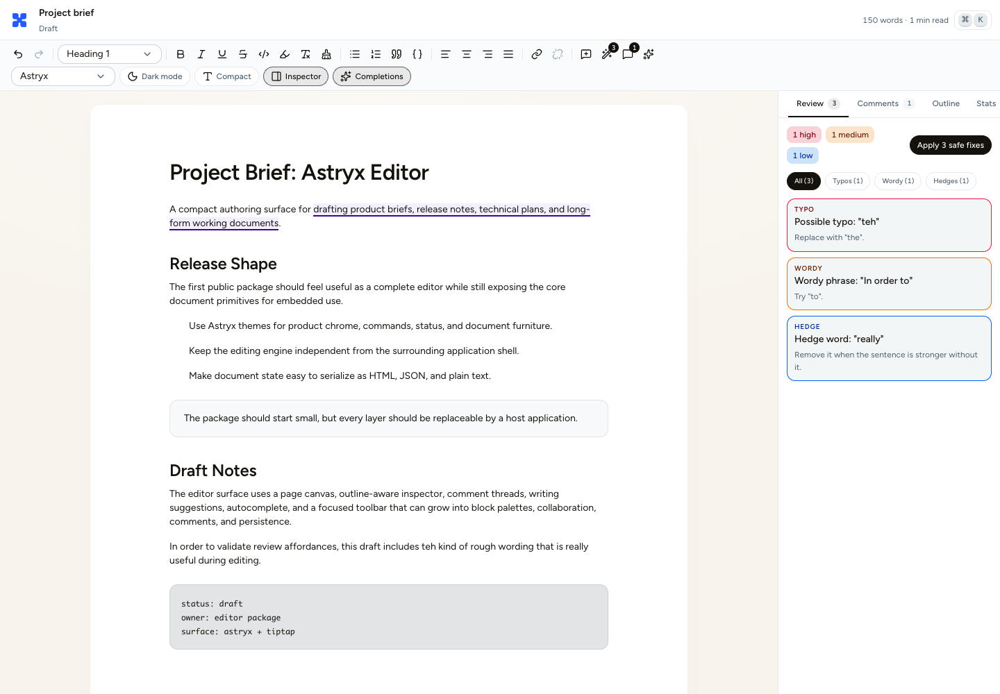

# Astryx Editor

Astryx Editor is an open-source progressive word editor prototype built with [Astryx](https://astryx.atmeta.com/), React, Vite, and Tiptap.

It takes the package shape of `astryx-sheet`: a complete demo shell for immediate use, plus embeddable layers that can be adopted by a host application over time.

Live demo: https://thedjpetersen.github.io/astryx-editor/



## Progressive Adoption

- Use `<WordEditor />` for the complete Astryx-themed writing surface with toolbar, page canvas, theme controls, stats, outline, and source inspector.
- Hide optional chrome such as the toolbar, theme controls, keyboard hints, or inspector when embedding inside an existing product shell.
- Use `createEditorExtensions()` when you want the same Tiptap schema and commands with your own React UI.
- Use `createEditorSnapshot()`, `getEditorStats()`, `getDocumentOutline()`, `getWritingSuggestions()`, and completion helpers when a host app only needs document state utilities.

```jsx
import {WordEditor} from 'astryx-editor';
import 'astryx-editor/styles.css';

export function EmbeddedEditor({initialHtml, onSave}) {
  return (
    <WordEditor
      defaultContent={initialHtml}
      showThemeControls={false}
      onDocumentChange={({html, json, text, stats}) => {
        onSave({html, json, text, stats});
      }}
    />
  );
}
```

## Features

- Astryx themes and component primitives for the app shell, ribbon controls, status tokens, inspector tabs, and page container
- Tiptap/ProseMirror document engine with headings, paragraphs, lists, blockquotes, code blocks, links, highlights, underline, typography transforms, text alignment, undo, and redo
- Inline document comments backed by a Tiptap mark, with threaded replies, jump-to-text, resolve/reopen/delete, avatar chips, and relative timestamps
- Grammarly-style local writing review for repeated words, common typos, wordy phrases, hedge words, passive constructions, and long sentences
- One-click and bulk suggestion application with a transient flash on the changed range, dismiss-with-restore, severity filters, and animated list collapse
- Autocomplete chips for current-word completion
- Offline AI-style continuation cards that simulate a hosted drafting provider without requiring network credentials
- Page-style word editor canvas with responsive desktop and mobile layouts
- Single-row toolbar with grouped commands for history, block styles, inline text, structure, alignment, links, review actions, and view controls, with shortcut tooltips on bound commands
- Cmd+K command palette that reuses the toolbar's handlers, fed by a single shortcut registry so hints can never drift from bindings
- Rename-in-place document title, designed link/comment dialogs (no native prompts), and toast feedback for batch actions
- Live document stats for words, characters, block count, headings, and estimated reading time
- Outline panel derived from document headings
- Review, comments, outline, stats, HTML, and JSON inspector views for persistence/debugging workflows
- Controlled/uncontrolled Astryx theme, dark mode, compact mode, inspector visibility, completion visibility, and comments props
- `onDocumentChange` callback with HTML, JSON, text, stats, outline, comments, and writing suggestion snapshots
- Package exports for the app, embeddable editor, toolbar, inspector, extension factory, comment mark, default content, completion helpers, writing review helpers, and document utilities

## Getting Started

```bash
npm install
npm run dev
```

Then open the Vite URL printed in your terminal.

## Useful Commands

```bash
npm run dev
npm run build
npm run preview
```

## Project Structure

```text
src/main.jsx                         # Vite demo bootstrap
src/index.js                         # package exports for embedding
src/app/                             # demo app + Astryx theme registry
src/editor/WordEditor.jsx            # embeddable editor component
src/editor/components/               # toolbar and inspector
src/editor/extensions.js             # Tiptap extension factory
src/editor/documentUtils.js          # snapshots, outline, and stats
src/editor/defaultContent.js         # demo document content
src/hooks/                           # reusable React hooks
src/styles.css                       # Astryx imports and editor styles
```

## License

MIT
